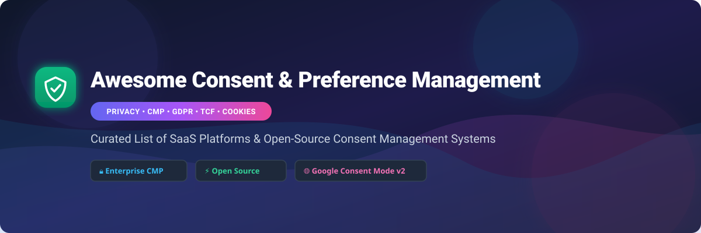

# 🛡️ Awesome Consent & Preference Management (CMP)

  
  
  
  
  
  

A curated, comprehensive ecosystem list of **Consent & Preference Management Platforms (CMP)**, **Cookie Consent Banners**, **GDPR/CCPA Compliance Tools**, **IAB TCF v2.2 Solutions**, and **Google Consent Mode v2 Libraries**.

---

## 📌 Table of Contents

- [🌐 SaaS / Hosted Platforms](#-saas--hosted-platforms)
- [⚡ Open-Source GitHub Projects](#-open-source-github-projects)
- [📚 Implementation Best Practices](#-implementation-best-practices)
- [🤝 How to Contribute](#-how-to-contribute)
- [📈 Star History](#-star-history)
- [💖 Support & Community](#-support--community)
- [⚖️ Disclaimer](#%EF%B8%8F-disclaimer)

---

## 🌐 SaaS / Hosted Platforms

> 📊 **Market Size & Sector Structure**: The global Consent Management Platform (CMP) market is estimated at **$1.8 Billion – $2.5 Billion in 2026** (expanding at an estimated CAGR of ~18.5%). The sector is **moderately fragmented**, led by enterprise compliance giants (e.g., OneTrust, Usercentrics) holding dominant enterprise share, while a competitive tail of specialized SaaS platforms and self-hosted tools cater to SMBs and open-source ecosystems.

Below is a curated comparison of leading commercial Consent Management Platforms, **sorted by company size (valuation / revenue descending)**:

| 🏢 Product / Vendor | 📝 Overview & Core Features | 💰 Starting Price | 🎁 Free Tier / Trial Limit | 📊 Company Size (Valuation / Rev) |
| :--- | :--- | :--- | :--- | :--- |
| **[OneTrust](https://www.onetrust.com/)** 🔒 | Enterprise privacy, GRC & consent platform with multi-domain CMP, preference centers, DSAR automation, and TCF v2.2 compliance. | `$30/month` (per domain CMP module) | `14-day free trial` (sales demo request required) | **$4.5B Valuation** / ~$500M ARR |
| **[Usercentrics](https://usercentrics.com/)** 🌐 | Leading global CMP with web & mobile SDKs, TCF support, multi-language banners, and native Google Consent Mode v2 integration. | `€12/month` (~$14/mo) | `30-day free trial` (up to 50,000 sessions) | **~$1.0B Valuation** / €100M+ ARR |
| **[TrustArc](https://trustarc.com/)** 🛡️ | Enterprise privacy governance suite featuring cookie consent management, website risk scanning, and international data transfer compliance. | `$249/month` (CMP Essentials) | `14-day free trial` | **~$250M Valuation** / ~$59.4M Rev |
| **[Didomi](https://www.didomi.io/)** 🚀 | Multi-channel consent & preference management platform for websites, mobile apps, and ad publishers. (Acquired Sourcepoint in 2025). | `€250/month` (~$275/mo) | `14-day free trial` (full feature access) | **~$200M Valuation** / ~$40M ARR |
| **[Osano](https://www.osano.com/)** ⚖️ | Data privacy platform providing automated cookie consent banners, website cookie scanning, and vendor privacy risk monitoring. | `$199/month` (Plus plan) | `Free forever plan` (1 domain, up to 5,000 visitors/mo) | **~$150M Valuation** / ~$44.4M Funding |
| **[Iubenda](https://www.iubenda.com/)** 📜 | All-in-one privacy compliance solution providing automated legal policies, cookie consent banners, and preference storage for web/apps. | `$2.42/month` ($29/year) | `Free forever plan` (up to 25,000 pageviews/month) | **~$100M Valuation** / ~$17.7M Rev |
| **[Crownpeak Consent](https://www.crownpeak.com/)** 🏛️ | Enterprise digital experience and consent governance suite built for complex multi-site, multi-brand global organizations. | `$350/month` | `14-day free trial` | **~$90M Valuation** / ~$25M Rev |
| **[Termly](https://termly.io/)** ⚙️ | Self-serve cookie consent banner, privacy policy generator, and legal compliance manager tailored for small and mid-sized websites. | `$10/month` (billed annually) | `Free forever plan` (1 website, up to 10,000 visits/mo) | **~$80M Valuation** / ~$10M Rev |
| **[Consentmanager](https://www.consentmanager.net/)** 📊 | Publisher-focused CMP specializing in multi-domain cookie compliance, IAB TCF support, and consent acceptance rate optimization. | `€12.50/month` (~$14/mo) | `Free forever plan` (1 domain, up to 10,000 pageviews/mo) | **~$60M Valuation** / ~$8M Rev |
| **[Cookiebot](https://www.cookiebot.com/)** 🍪 | Automated cookie consent banner and scanning solution featuring script blocking and Google Consent Mode v2. *(By Usercentrics)*. | `€7/month` (~$8/mo) | `Free forever plan` (1 domain, up to 50 subpages) | Part of Usercentrics (**€100M+ ARR**) |

---

## ⚡ Open-Source GitHub Projects

Open-source consent tools provide full ownership over user data, zero vendor lock-in, and cost-effective compliance for developer-centric stacks. Below is a curated list of top open-source projects, **sorted by GitHub stargazers count (descending)**:

- **[cookieconsent](https://github.com/orestbida/cookieconsent)**   
  *Lightweight, standalone vanilla JavaScript cookie consent plugin featuring modular consent categories, multi-language support, dark mode, and Google Consent Mode v2 support.*

- **[Osano CookieConsent](https://github.com/osano/cookieconsent)**   
  *Popular open-source JavaScript library for building customizable cookie consent banners with simple callback-driven script execution control.*

- **[c15t](https://github.com/c15t/c15t)**   
  *Modern, developer-first open-source consent management framework equipped with automatic script loaders, Consent Mode v2 patterns, and flexible UI adapters.*

- **[Klaro](https://github.com/kiprotect/klaro)**   
  *Privacy-friendly, GDPR-focused consent manager providing self-hosted consent banners, dynamic script blocking, service purpose grouping, and clean zero-dependency design (BSD-3).*

- **[spatie/laravel-cookie-consent](https://github.com/spatie/laravel-cookie-consent)**   
  *Spatie's popular open-source Laravel package for quickly integrating compliant cookie consent dialogs into PHP/Laravel applications.*

- **[tarteaucitron.js](https://github.com/AmauriC/tarteaucitron.js)**   
  *Comprehensive French-origin consent manager with native integrations for over 100 tracking services, Google Consent Mode v2, and CNIL compliance directives.*

- **[GDPR Transparency & Consent Framework](https://github.com/InteractiveAdvertisingBureau/GDPR-Transparency-and-Consent-Framework)**   
  *IAB Tech Lab reference implementations, specifications, and binary string decoders/encoders for the industry-standard TCF v2.2 specification.*

- **[react-cookie-consent](https://github.com/Mastermindzh/react-cookie-consent)**   
  *Small, highly customizable React component for rendering accessible cookie consent banners with built-in cookie state management.*

- **[whitecube/laravel-cookie-consent](https://github.com/whitecube/laravel-cookie-consent)**   
  *Flexible Laravel package allowing developers to declare, organize, and request user cookie consents in full compliance with European regulations.*

- **[Cookies-EU-banner](https://github.com/Alex-D/Cookies-EU-banner)**   
  *Ultra-lightweight (~1KB) vanilla JS script designed to manage cookie consent banner display and conditional tracking script execution under GDPR.*

- **[use-cookie-consent](https://github.com/bring-shrubbery/use-cookie-consent)**   
  *Minimalist React hook (~1KB gzipped) for managing consent state across React, Next.js, and Gatsby web applications.*

- **[consent-manager](https://github.com/segmentio/consent-manager)**   
  *Segment's drop-in consent manager plugin for Analytics.js, allowing websites to selectively enable analytics destinations based on explicit user consent.*

---

## 📚 Implementation Best Practices

1. **Script Blocking**: Ensure non-essential analytics and marketing scripts (e.g., Google Analytics, Meta Pixel) are blocked until explicit consent is given.
2. **Google Consent Mode v2**: Implement default consent signals (`analytics_storage='denied'`, `ad_storage='denied'`) before tags fire, then update state upon user choice.
3. **IAB TCF v2.2**: For programmatic advertising publishers, ensure your CMP encodes valid TC Strings passed via `__tcfapi`.
4. **Audit Logs**: Maintain proof of consent records including timestamp, consent version, and user action for regulatory reporting.

---

## 🤝 How to Contribute

Contributions are welcome! To add or update a tool:

1. Fork the repository.
2. Update [`README.md`](file:///C:/Users/ishan/Documents/Projects/Awesome-Consent-Preference-Management/README.md) following the existing tabular / badge formatting.
3. Ensure entries include verifiable pricing, free tier limits, or repository star counts.
4. Submit a Pull Request with a clear description of your changes.

Check out [Awesome Awesome Awesome](https://github.com/ishandutta2007/Awesome-Awesome-Awesome) for more curated lists!

---

## 📈 Star History

---

## 💖 Support & Community

Thank you for exploring **Awesome Consent & Preference Management**! If this repository helped you discover the right CMP platform or open-source library:

- ⭐ **Star this repository** on GitHub to support its growth.
- 🍴 **Fork it** to add new privacy tools or customize it for your team.
- 📢 **Share it** with privacy engineers, web developers, and compliance leads.
- ☕ **Sponsor / Buy me a coffee**: Support ongoing maintenance via [GitHub Sponsors](https://github.com/sponsors/ishandutta2007).

---

## ⚖️ Disclaimer

- This is a community-curated directory intended for informational and educational purposes.
- Deploying a CMP software library does not automatically guarantee compliance with GDPR, CCPA, or regional privacy laws. Consult legal counsel for jurisdiction-specific compliance.
